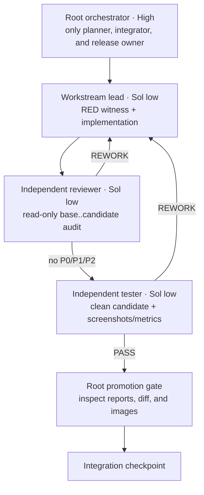
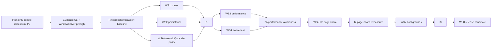

# Array 0.8.0 overnight release orchestration

**Written:** 2026-08-30
**Pinned starting point:** `d41598dd` (`Array 0.7.4`) on `array/integration`
**Candidate target:** Array 0.8.0, build 56
**Purpose:** produce one integrated, morning-testable release candidate containing every product change in this program. Do not publish, tag, push, mutate the appcast, or replace `/Applications/Array.app` without Dylan's explicit release approval.

This is the durable state for the active goal. Conversation memory is not the state machine. The root orchestrator updates this document after every promotion checkpoint and stores all evidence below one immutable `qa-runs/<run-id>/` directory.

The root-facing per-feature test index is `.plans/54-test-evidence-matrix.md`; the individual executable contracts live under `.plans/54-prompts/`.

## 1. Locked product contract

These decisions are closed for this release. Agents implement and verify them; they do not reopen them.

1. **Zone resize and auto layout**
   - A tile resize changes the active tile and may minimally expand its owning zone.
   - Passive tile frames and sizes remain exact.
   - A manual zone resize changes only that zone's placement. It does not pack members, shrink members, or push neighboring zones.
   - A zone cannot shrink through the padded member envelope.
   - Broad reflow belongs only to the explicit **Tidy Zone Now** action or a deliberate tile drop/slot exchange.
   - The dimension HUD appears and updates for both tile and zone resize, then disappears on mouse-up, cancellation, lost capture, or window resignation. It reports world dimensions.

2. **Workspace persistence**
   - Zone placement, membership, viewport, active zone, and focus round-trip exactly through cold reload and A → B → A workspace switching.
   - Project canvas files own project tiles; workspace documents own zone/workspace state.
   - Persisted tile frames are world-space; hydrated `ZoneLayer` frames are zone-local.
   - Normal close flushes acknowledged live state before teardown.
   - A failed write preserves the last valid document and surfaces failure rather than claiming success.

3. **Performance**
   - The reported power-user corpus is a first-class scenario: three projects; three to five active agents per project; one or two browser tiles per project; long, streaming transcripts; file-tree activity; relay activity; simultaneous pan/zoom.
   - Fixes must follow measured profiles. No speculative rewrite and no weakened or newly allowlisted budget.
   - Structural work counters are the blocking teeth; same-machine release-build timing, CPU, memory, storage, and hitch data are retained alongside them.
   - The existing Friday CPU and disk diagnostics remain evidence, not a claim of a signal crash.

4. **Completion awareness**
   - Completion while the tile is actively viewed produces a brief finite green glow/pulse and is considered read without requiring exit/re-entry.
   - Completion while away or while Array is inactive remains unread until a deliberate visit.
   - Failure and action-required remain semantically stronger and do not collapse into ordinary success.
   - Reduce Motion receives a finite static acknowledgment for the same brief window, then returns to the ordinary read appearance with no repeating animation or steady-state timer.

5. **Managed-agent page zoom**
   - Browser-style per-tile commands: zoom in, zoom out, reset.
   - Scale all inner managed-agent content—transcript, status, composer, and controls—while the outer tile title bar and tile world geometry remain fixed.
   - State is temporary and per tile for this release: it resets when that tile/runtime is recreated and is not written to workspace/project persistence.
   - Zoom preserves semantic scroll anchor, selection, disclosures, tail-following, hit testing, and accessibility.

6. **Transcript hierarchy**
   - Improve scan rhythm and hierarchy without returning to chat bubbles or loud speaker labels.
   - Cover Claude, Codex, and Pi from raw provider events through the shared semantic document and renderer.
   - Reasoning, tools, tool summaries, command output, file edits, add/delete/rename, and diffs receive equivalent semantics and hierarchy across providers.
   - Keep the user authorship rule and separator; reduce excessive turn whitespace only after deterministic geometry and rendered review.

7. **Canvas backgrounds**
   - Global defaults plus optional per-workspace override/inherit.
   - Presets: solid, line grid, dot grid.
   - Custom base and grid foreground colors.
   - Optional managed local image with opacity and Fill/Fit.
   - Base/image are screen-fixed. Grid is world-aligned and follows pan/zoom.
   - No gradients, blur, animation, or per-grid-element views/layers in this release.

## 2. Agent topology

The live root runs at High. Every workstream worker runs `gpt-5.6-sol` at `low`. The model choice is intentional: Sol supports low effort, and the packets compensate with explicit context, constraints, evidence, and binary success criteria.



### Layer rules

- Root is the only agent allowed to schedule workstreams, arbitrate shared files, promote commits, run integration checkpoints, or prepare release state.
- A workstream lead may spawn a child **only** for a bounded implementation split or auxiliary read-only review/testing. It may not spawn a researcher, planner, project manager, or another orchestrator. Final independent reviewer/tester approval comes from root-dispatched peer agents, never a child approving its parent.
- With four total slots, the normal shape is root + three peer workers. Nested children run only when a peer slot is free; they do not create extra capacity.
- Author, final reviewer, and final tester must be three different agent identities. If a reviewer edits code, that agent loses reviewer independence.
- Every agent receives one worktree, one pinned base SHA, one ownership set, one evidence directory, and one packet from `.plans/54-prompts/`.

## 3. Dependency graph and overnight waves



### Wave 0 — baseline and QA preflight

- At live start, root first creates local checkpoint **P0** from `d41598dd` containing only this reviewed `.plans/54-*` control packet. Root proves `d41598dd..P0` changes no product/build/release file and does not push it. All isolated worktrees begin at P0 so their checked-in reference packet matches the rendered dispatch.
- A test-infrastructure lead implements and proves the evidence CLI and GUI preflight in `00-evidence-harness.md`; independent review/test applies before feature dispatch.
- Root promotes that reviewed harness-only result as checkpoint **E0**, verifies the product source is otherwise identical to `d41598dd`, and records E0 in the ledger. The baseline and every later workstream must descend from E0 so `scripts/release-evidence.js` and release-aware `run-perf-ceilings.sh` actually exist; no later packet is dispatched directly against `d41598dd` or P0.
- Root creates the immutable run root. The preflight must verify an unlocked WindowServer session, Screen Recording pixels, Accessibility driving, fixed window sizes, actual backing scale, WKWebView capture, appearance switching, isolated state, and a sleep-prevention assertion. If any prerequisite is unavailable, mark the live visual lane `DISPLAY_DEFERRED` immediately instead of discovering it after implementation.
- A testing-role agent runs the current focused checks and records which are green, KNOWN-RED, false-green, display-deferred, or missing. The current authoritative `MATRIX_KNOWN_RED` array contains eight flags; comments and old docs do not override the array.
- Do not bless any baseline. Current auto-layout expectations that enforce passive-tile shrinking and zone-driven reflow are explicitly obsolete and must be rewritten.

### Wave 1 — independent foundations

- Worker A: WS1 zones/HUD/auto-layout.
- Worker B: WS2 workspace persistence.
- Worker C: WS6 transcript/provider parity.
- Rotate reviewer and tester roles after implementation so nobody evaluates their own branch.
- Root promotes only complete green branches, then runs I1.

### Wave 2A — measured performance and awareness

- Recreate clean worktrees from I1.
- Worker A: WS3 measured performance and compound corpus.
- Worker B: WS4 completion awareness.
- Worker C provides eligible cross-review/testing as each candidate becomes ready; never run parallel performance samples or parallel live UI automation on the same host.
- WS3 owns all five performance-related KNOWN-RED flags. If it cannot produce structural green after its profiling/fix gate, the release outcome is `NOT READY`; a waiver cannot convert it to PASS.
- Rotate reviewer/tester roles, promote WS3/WS4, then run I2A.

### Wave 2B — managed-agent page zoom and performance remeasure

- Recreate a clean WS5 worktree from I2A. WS5 is deliberately serialized after WS3 because both touch managed-agent measurement/cache/layout behavior.
- One worker implements WS5, another independently reviews, and the third tests.
- Re-run the full WS3 release-build performance matrix and compound scenario on the WS5 candidate before promotion. Page zoom may not invalidate WS3 attribution or turn a remediated perf leg red.
- Root promotes and runs I2.

### Wave 3 — background customization

- Recreate a clean worktree from I2.
- One lead implements WS7; the two other workers independently review and test it.
- Root promotes and runs I3.

### Wave 4 — release candidate

- One read-only worker audits version/build/release inputs and drafts notes; a second independently reviews matrix inventory and packaging inputs. Both reports are ingested and the evidence root validates before artifact creation.
- Root alone, from the exact clean I3 SHA, records the release-script hash/argv and stamps/builds/signs/notarizes exactly one unpublished 0.8.0/build 56 canonical DMG after the pre-artifact audit is green.
- Root creates and ingests a canonical identity manifest binding candidate SHA → release command/log → bundle identity/tree → embedded executable → codesign requirement/Team ID → app/DMG notary submissions/staples/Gatekeeper → DMG SHA-256.
- A third worker verifies that exact DMG from a second clean checkout and scratch store, recomputes the mounted bundle/executable/tree/signing/notary/Gatekeeper chain, and writes a report. The independent reviewer then reconciles the final identity manifest and tester report without editing.
- Root ingests both post-artifact reports, validates the full evidence root, generates `morning-report.md` last, ingests it, and validates once more. `READY` cannot exist before this order completes. Do not designate a dev preview as a competing release candidate.
- Root does not publish, tag, push, mutate the appcast, or append the shipped ledger row.

### Deadline and critical-path policy

The morning boundary is a checkpoint, not permission to skip a gate. An independent feasibility audit estimated roughly 24–58 hours for all seven implementations plus new harnesses, independent review/testing, display capture, performance soaks, full matrices, and packaging. The run still targets the overnight window by batching disjoint work, but it must report `NOT READY` with the exact last green checkpoint if the candidate is not honest by morning; the active goal then continues rather than manufacturing green evidence.

Execution is scheduled with these phase barriers:

| Phase | Serial lane | Safe concurrent work |
|---|---|---|
| Wave 0 | one GUI/permission preflight | evidence schema review, baseline source audit |
| Wave 1 | root promotion and one display-test lane | three implementations; then three cross-reviews/check suites |
| I1 | root integration | report/hash validation only |
| Wave 2A | one release-perf lane; one display lane | WS4 code/review and non-timed semantic checks |
| Wave 2B | one WS5 live display lane; then perf remeasure | read-only diff/report validation |
| Wave 3 | one WS7 live display lane | Core/model review and artifact validation |
| RC | root artifact assembly; one clean-artifact test lane | release-note/evidence audit |

Never run two live Array UI drivers, two release performance samples, or a Swift build concurrently with a measured performance window on the same host.

## 4. Worktree and ownership protocol

At live start, root records `BASE_SHA` and creates worktrees outside the main checkout, for example:

```text
/Users/dylan/Documents/personal/Array-wt/080-ws1-zones
/Users/dylan/Documents/personal/Array-wt/080-ws2-persistence
/Users/dylan/Documents/personal/Array-wt/080-ws6-transcript
```

Each worker branch is created from the checkpoint SHA. Workers may commit only to their assigned branch. They do not merge, rebase, push, tag, sign, notarize, or edit release/feed files. Root promotes an exact reviewed candidate through ordered cherry-pick or a no-ff merge and immediately runs the checkpoint.

Shared choke points—`ContinuumApp.swift`, `scripts/run-matrix.sh`, `WorkspaceDocument.swift`, `CanvasNSView.swift`, `ManagedAgentTileNSView.swift`, and transcript measurement/cache files under `Canvas/AgentTranscript/`—require an explicit narrow hunk grant in the dispatch prompt. A worker stops rather than taking an unowned hunk.

## 5. Mandatory promotion state machine

Every implementation workstream (the Wave-0 harness and WS1–WS7) follows this exact sequence. The baseline and WS8 audits are read-only and follow their packet-specific gates instead of the implementation/RED/tooth steps:

1. **Baseline:** record pinned SHA, clean status, existing relevant commands, and current output.
2. **RED:** add an outcome-based witness that fails for the reported behavior. Source-text assertions do not count.
3. **Implementation:** implement the smallest cohesive model and production wiring that satisfies the locked contract.
4. **GREEN:** run the new witness, relevant existing checks, build, and workstream-specific checks.
5. **Tooth proof:** retain the witness while reverting the behavioral implementation in a disposable checkout; prove RED; restore and prove GREEN.
6. **Independent review:** read-only audit of the entire base-to-candidate diff and evidence. No unresolved P0/P1/P2.
7. **Independent test:** clean checkout, production-path exercise, deterministic screenshots/semantic output, and workstream-specific stress.
8. **Root visual gate:** root opens one representative image/contact sheet for every unique visual state and every nonzero/failing diff. Repetition-only raw captures remain linked in the manifest and need not be opened one by one. A path in a report is not visual approval.
9. **Promotion:** root checks ownership, reports, hashes, and focused smoke; promotes the exact candidate SHA.
10. **Checkpoint:** integration tests run immediately. A branch is not integrated until the checkpoint passes.

One ordinary environmental retry is allowed with unchanged code and a fresh isolated store. One corrective implementation round is allowed after a genuine review/test defect. A second genuine failure escalates to root. Flaky gates require three consecutive passes with all logs retained.

## 6. Evidence and screenshot contract

One durable root:

```text
/Users/dylan/Documents/personal/Array/qa-runs/<UTC-run-id>/
  baseline/
  ws1-zones/{lead,review,test}/
  ws2-persistence/{lead,review,test}/
  ws3-performance/{lead,review,test}/
  ws4-awareness/{lead,review,test}/
  ws5-page-zoom/{lead,review,test}/
  ws6-transcript/{lead,review,test}/
  ws7-backgrounds/{lead,review,test}/
  integration-{I1,I2A,I2,I3}/
  release/{pre-audit,pre-review,canonical,artifact-test,post-review,final}/
  manifest.json
```

Every role directory contains `report.json`, `commands.log`, `git-status.txt`, base/candidate SHAs, RED/GREEN logs where applicable, semantic JSON, screenshots, diffs, and raw performance data. Final evidence never lives only under `/tmp`.

For live windows, use the existing `QACapture`/external QA flow path because it captures WKWebView and other WindowServer-backed pixels. For deterministic AppKit components, use `UIProbe` at explicit size, appearance, 2× scale, and fixed fixture state. Screenshots never pass a flow by themselves: each scenario has at least one semantic/geometry/state assertion.

Standard live content area is `1440×900 pt` at a fixed origin; compact coverage uses `960×720 pt`. Static visual states cover Aqua and Dark Aqua. Capture readiness is a named state—layout transaction settled, navigation finished, persistence generation acknowledged, transcript generation applied, or deterministic animation phase—not an arbitrary sleep.

Measurement repetition and visual capture are separate. Semantic/geometry cases run the packet's full repeat count in a machine-readable batch; after they pass, capture one deterministic representative image per unique visual state/zoom/appearance plus every failure. Do not multiply screenshots by repetition count.

Each visual case declares its expected unique state IDs/appearances. Each image entry records case/iteration/state ID, role (`baseline`, `actual`, `diff`, `contact_sheet`, or `failure`), absolute path, SHA-256, commit, fixture UUIDs, appearance, point/pixel size, backing scale, canvas zoom, tile zoom, camera/world coordinates, triggering action, readiness condition, semantic artifact, diff status/magnitude, primary designation, and tester inspection. Baseline pairs also pin the checked-in baseline path/blob hash/commit; masks retain their file/hash and narrow rationale. A surface with no approved baseline is `candidate_only/NEEDS_JUDGMENT`, never an implicit zero-diff PASS.

The Wave-0 evidence CLI reconciles declared unique states against actual/contact-sheet membership, requires an absolute path for every representative and every nonzero/failing diff, computes hashes, rejects missing/out-of-root/schema-invalid artifacts, and atomically writes the root manifest. A failed visual-capable iteration retains a linked failure image; if capture itself is unavailable, a typed `capture_unavailable` diagnostic is a blocker. Contact sheets are optional, but when absent root opens the individual actual/diff PNG for every unique state.

Performance reports declare exact cases, repetitions, roles, release binary hash/configuration, and seed. Every run 01–05, profiler/signpost/sample/vmmap output, soak stream/summary, diagnostic before/after/diff, and visual boundary is an individually hashed typed artifact. Directories and summary numbers alone are not evidence; validation rejects extra/missing repetitions, identity mismatch, and summaries not traceable to retained raw files.

The root task displays the most diagnostic images during the run and includes the primary absolute paths in the morning report.

## 7. Integration checkpoints

### I1 — zones, persistence, transcript

```sh
export CONTINUUM_PROJECT_ROOT="<QA_PROJECT_ROOT>"
export CONTINUUM_APP_SUPPORT="<QA_APP_SUPPORT>"
export TMUX_TMPDIR="<QA_TMUX_TMPDIR>"
unset TMUX TMUX_PANE
swift build
swift run ContinuumRevivedCoreChecks
swift run ContinuumRevivedAgentContentChecks
swift run ContinuumRevivedAgentUIChecks
.build/debug/Array --zone-resize-check
.build/debug/Array --resize-dimensions-hud-check
.build/debug/Array --workspace-switch-check
.build/debug/Array --workspace-boot-persistence-check
.build/debug/Array --workspace-restart-fault-check
.build/debug/Array --transcript-rhythm-check
.build/debug/Array --transcript-provider-parity-check
scripts/run-matrix.sh --fast
```

Run all newly registered WS1/WS2/WS6 witnesses in addition to this list.

### I2A / I2 — performance, awareness, then page zoom

```sh
export CONTINUUM_PROJECT_ROOT="<QA_PROJECT_ROOT>"
export CONTINUUM_APP_SUPPORT="<QA_APP_SUPPORT>"
export TMUX_TMPDIR="<QA_TMUX_TMPDIR>"
unset TMUX TMUX_PANE
swift build
swift build -c release
.build/debug/Array --completion-awareness-viewed-check
swift run -c release ContinuumRevivedPerfChecks
.build/release/Array --perf-budget-zoom-check
.build/release/Array --canvas-zoom-invalidation-probe-check
.build/release/Array --perf-budget-magnify-slope-check
.build/release/Array --perf-budget-gesture-transition-check
.build/release/Array --tile-surface-residency-check
.build/release/Array --perf-power-user-compound-check
CONTINUUM_PERF_CONFIGURATION=release \
CONTINUUM_PERF_APP="<WORKTREE>/.build/release/Array" \
CONTINUUM_PERF_OUT="<EVIDENCE_DIR>/perf-ceilings" \
CONTINUUM_PERF_RUN_ID="<RUN_ID>-integration" \
scripts/run-perf-ceilings.sh
scripts/run-matrix.sh --fast
```

The direct `.build/release/Array` legs and release-configured ceilings are release-performance evidence; `scripts/run-matrix.sh --fast` is debug integration coverage and is labeled as such. Run the compound power-user scenario and `--completion-awareness-viewed-check` at I2A. At I2, rerun this whole block and additionally run `.build/debug/Array --managed-agent-page-zoom-check`; then inspect page-zoom screenshots before promotion.

### I3 — backgrounds and whole product

```sh
export CONTINUUM_PROJECT_ROOT="<QA_PROJECT_ROOT>"
export CONTINUUM_APP_SUPPORT="<QA_APP_SUPPORT>"
export TMUX_TMPDIR="<QA_TMUX_TMPDIR>"
unset TMUX TMUX_PANE
swift build
swift build -c release
.build/debug/Array --completion-awareness-viewed-check
.build/debug/Array --managed-agent-page-zoom-check
.build/debug/Array --canvas-background-check
.build/release/Array --perf-budget-zoom-check
.build/release/Array --canvas-zoom-invalidation-probe-check
.build/release/Array --perf-budget-magnify-slope-check
.build/release/Array --perf-budget-gesture-transition-check
.build/release/Array --tile-surface-residency-check
.build/release/Array --perf-power-user-compound-check
CONTINUUM_PERF_CONFIGURATION=release \
CONTINUUM_PERF_APP="<WORKTREE>/.build/release/Array" \
CONTINUUM_PERF_OUT="<EVIDENCE_DIR>/perf-ceilings" \
CONTINUUM_PERF_RUN_ID="<RUN_ID>-i3" \
scripts/run-perf-ceilings.sh
scripts/run-matrix.sh
scripts/check-app-bundle.sh --configuration release --channel dev --output-dir "<EVIDENCE_DIR>/i3-bundle-preflight"
```

Judge the matrix by its final inventory summary, not only its exit status. The full matrix is debug integration coverage, not proof about the release executable. The direct release-binary legs, release-configured ceiling runner, and release DEV bundle are the pre-artifact release-configuration coverage; canonical production-bundle coverage happens only after root creates the DMG. The matrix currently exits zero for an allowlisted failure and also for an unexpected pass, so every listed item must be classified explicitly. Every new leg must visibly run. A formerly KNOWN-RED leg that passes three times must be removed from the allowlist through review; every performance-related KNOWN-RED must be green before release readiness.

## 8. Hard stop conditions

Stop and preserve evidence if any of the following occurs:

- a worker may have touched `/Applications/Array.app`, production Application Support, production defaults, or a real project `.array/`;
- an unknown check flag boots the full app;
- base SHA or dirty ownership is ambiguous;
- a schema migration loses unknown fields or old fixtures;
- passive geometry changes outside explicit Tidy;
- a known-red budget is weakened, rebaselined, or newly allowlisted;
- a new unexpected matrix failure appears;
- author/reviewer/tester independence is broken;
- screenshots or raw metrics are missing;
- a required visual state/diff is `DISPLAY_DEFERRED`, `capture_unavailable`, or absent;
- a raw performance repetition/profile/soak/diagnostic artifact or canonical identity-chain field is absent;
- Swift 6 release build, identity, signing, notarization, Gatekeeper, or bundle validation fails.

Do not merge “mostly complete” work. Record the exact last known-good checkpoint SHA and failing evidence paths.

## 9. Morning handoff

The morning report must lead with one of:

- **READY TO TEST** — integrated candidate is built and every blocking gate passed;
- **READY WITH NAMED WAIVER** — only Dylan can decide a specifically evidenced subjective visual judgment; a failing requested performance/behavior gate cannot be waived into READY;
- **NOT READY** — blocker, last good SHA, affected workstream, and exact evidence.

Any required `DISPLAY_DEFERRED`, capture-unavailable state, missing unique visual/diff, missing canonical identity field, missing raw performance artifact, or otherwise unverified blocking gate forces **NOT READY**. **READY WITH NAMED WAIVER** is limited to a completed, objectively green implementation whose remaining question is a genuinely subjective visual judgment; it links the exact actual/diff image. It cannot waive missing evidence, environment access, behavior, performance, persistence, security, signing, or artifact identity.

It then includes:

- candidate SHA and app path;
- implemented behavior by workstream;
- commands and real results;
- all unexpected/known-red status;
- primary screenshots displayed and linked by absolute path;
- before/after performance table and soak result;
- crash/hang/diagnostic diff;
- skipped/unverified items with reason;
- release publication steps still intentionally not taken.

## 10. Method references

- OpenAI's GPT-5.6 guidance recommends explicit domain context, hard constraints, approval boundaries, success criteria, and representative evaluations: <https://developers.openai.com/api/docs/guides/latest-model>.
- GPT-5.6 Sol supports low reasoning effort: <https://developers.openai.com/api/docs/models/gpt-5.6-sol>.
- XCTest provides CPU, clock, hitch, memory, signpost, and storage metrics for repeatable performance tests: <https://developer.apple.com/documentation/xctest/performance-tests>.
- XCTest attachments retain screenshots and other test artifacts beside results: <https://developer.apple.com/documentation/xctest/adding-attachments-to-tests-activities-and-issues>.
- Apple's CPU guidance recommends correlating measured regressions with Instruments and signposts, then rerunning the performance test: <https://developer.apple.com/documentation/xcode/addressing-cpu-bottlenecks>.
- Point-Free's snapshot-testing workflow records a reference, fails the first run, and compares later renders with inspectable diffs: <https://github.com/pointfreeco/swift-snapshot-testing>. Array already has this pattern in `UIProbeBaseline`, so this release reuses the existing harness instead of adding a new dependency.
